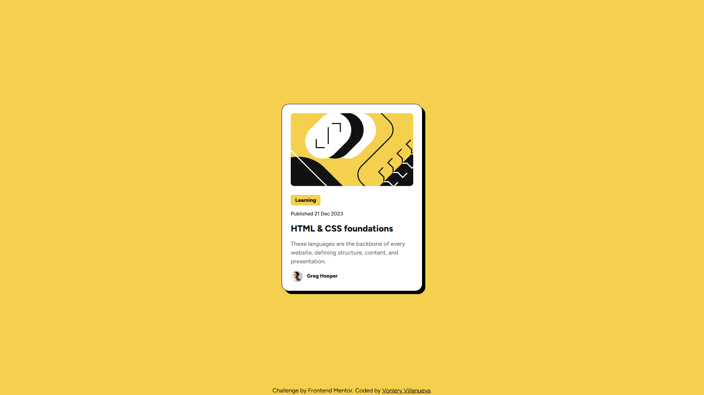
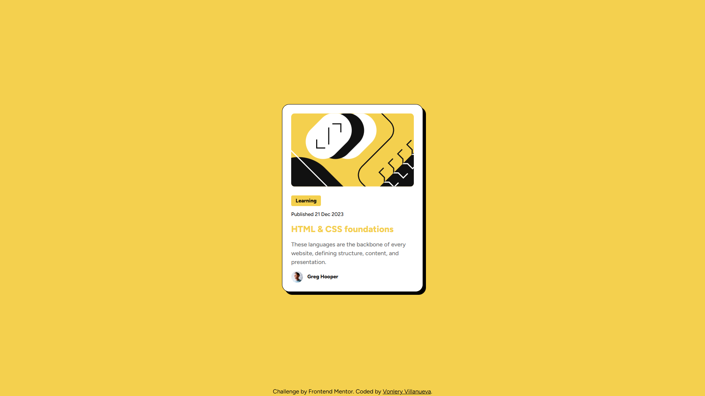

# Frontend Mentor - Blog preview card solution

This is a solution to the [Blog preview card challenge on Frontend Mentor](https://www.frontendmentor.io/challenges/blog-preview-card-ckPaj01IcS). Frontend Mentor challenges help you improve your coding skills by building realistic projects. 

## Table of contents

- [Overview](#overview)
  - [The challenge](#the-challenge)
  - [Screenshot](#screenshot)
  - [Links](#links)
- [My process](#my-process)
  - [Built with](#built-with)
  - [What I learned](#what-i-learned)
  - [Continued development](#continued-development)
- [Author](#author)

## Overview

### The challenge

Users should be able to:

- See hover and focus states for all interactive elements on the page

### Screenshot

### Links

- Solution URL: [Solution URL](https://github.com/bonlery/Frontend-Mentor---Blog-Preview-Card)
- Live Site URL: [Live Site URL](https://bonlery.github.io/Frontend-Mentor---Blog-Preview-Card/)

## My process

  1. Created an environment of TypeScript/TailwindCSS, though unnecessary, to build/practice with.
  2. Learned about transitioning from vanilla css to tailwind.
  3. Componentized the blog preview card.
  4. Developed the blog preview card together with figma for accuracy.
  5. Publish.

### Built with

- Semantic HTML5 markup
- CSS custom properties
- Flexbox
- [React](https://reactjs.org/)
- [TailwindCSS] (https://tailwindcss.com/) 
- [TypeScript](https://www.typescriptlang.org/)

### What I learned

A lot about tailwindCSS, without much for typescript/react.

### Continued development

Hopefully, in future projects, i'll do challenges that challenge the tools I try to work with.

**Note: Delete this note and replace the list above with resources that helped you during the challenge. These could come in handy for anyone viewing your solution or for yourself when you look back on this project in the future.**

## Author

- Frontend Mentor - [@bonlery](https://www.frontendmentor.io/profile/bonlery)
